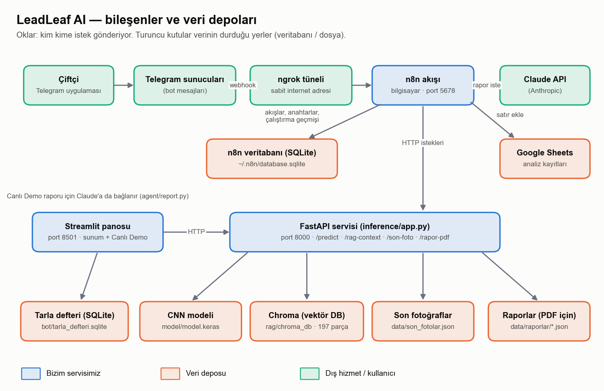

# LeadLeaf AI: Yaprak Fotoğrafından Bitki Hastalığı Ön Değerlendirmesi

Çiftçi, hastalıklı olduğundan şüphelendiği yaprağın fotoğrafını Telegram botuna gönderir. Hastalık bir
derin öğrenme modeliyle tahmin edilir, bilgi tabanından bu hastalığa ait doğrulanmış kaynak metin
bulunur (RAG) ve Claude bu metne dayanarak sade bir Türkçe rapor yazar. Modelin emin olmadığı
durumlarda çiftçi ziraat mühendisine yönlendirilir.

**Telegram botu:** [@LeadLeafAI_bot](https://t.me/LeadLeafAI_bot)

> Sistemin ürettiği çıktı kesin teşhis değil, ön değerlendirmedir. İlaç markası, kesin doz ve hasat
> öncesi bekleme süresi verilmez; bu kararlar ruhsatlı ziraat mühendisine bırakılır.

## Problem

Zararlı ve hastalıklar nedeniyle her yıl küresel bitkisel üretimin %40'a kadarı kaybedilmektedir;
bitki hastalıklarının küresel ekonomiye yıllık maliyeti 220 milyar doları aşmaktadır (FAO / IPPC,
2021). Erken teşhis kaybı azaltmanın en önemli adımlarından biridir, ancak hastalığın yapraktan
tanınması uzmanlık gerektirir ve uzmana her zaman hızlı ulaşılamaz.

## Mimari



| Katman | Görev | Araç |
|---|---|---|
| DL-Model | Görüntüden hastalık sınıfı ve güven değeri | EfficientNetB0 (transfer learning, TensorFlow/Keras) |
| LLM-Agent | Bilgi tabanından kaynak bulma ve rapor yazma | Chroma + sentence-transformers (RAG), Claude |
| Otomasyon | Telegram mesajı, PDF raporu, kayıt, uzman bildirimi | n8n |
| Arayüz | Çiftçi arayüzü ve sunum panosu | Telegram botu, Streamlit |

## Sonuçlar

| Ölçüt | Değer |
|---|---|
| Veri seti | PlantVillage, 54.305 görsel, 14 bitki, 38 sınıf |
| Bölme | Sınıf bazında %70 eğitim, %15 doğrulama, %15 test (sabit seed) |
| Test doğruluğu (8.146 görsel) | %99,02 (Colab), %98,98 (yerel yeniden değerlendirme) |
| Macro F1 | 0,9859 (Colab), 0,9855 (yerel) |
| Güven eşiği (%70, yerel) | Tahminlerin %98,8'ine cevap verilir; bu cevapların doğruluğu %99,5'tir |

Model seçimi deneyle yapılmıştır: MobileNetV2, MobileNetV3Small ve EfficientNetB0 aynı veri ve aynı
ayarlarla karşılaştırılmış, en iyi sonucu veren EfficientNetB0 kademeli fine-tuning ile 38 sınıfa
uygulanmıştır. Ayrıntılar Streamlit panosundaki Model Karşılaştırması ve Fine-Tuning sayfalarındadır.

## Bilinen Sınırlılıklar

- Görseller laboratuvarda, sade arka plan önünde çekilmiştir; tarla fotoğraflarındaki başarı ayrıca
  ölçülmelidir.
- Model yalnızca 38 sınıfı tanır. Veri setinde olmayan bir hastalık, en çok benzediği sınıfa
  atanabilir. Bu nedenle kullanıcının bitkiyi doğrulaması istenir; fotoğraf o bitkinin hiçbir
  sınıfına uymuyorsa teşhis konulmaz ve kullanıcı uzmana yönlendirilir.
- Raporlar bir ziraat mühendisi tarafından sistematik olarak değerlendirilmemiştir.

## Klasör Yapısı

```
agent/       Rapor üretimi, RAG araması, hava durumu, PDF; knowledge/ altında 38 hastalık bilgi dosyası
inference/   Model servisi (FastAPI): /predict, /rag-context, /generate-pdf
rag/         Bilgi tabanı indeksini oluşturan betikler
notebooks/   Veri analizi, model eğitimi (Colab) ve yerel test değerlendirmesi
model/       Üretim modeli (model.keras), sınıf adları, test sonuçları ve eğitim grafikleri
n8n/         Telegram botunun n8n akışı (workflow.json)
ui/          Streamlit sunum panosu ve canlı demo
bot/         Kayıt veritabanı yardımcısı
```

## Kurulum ve Çalıştırma

Python 3.9 ile test edilmiştir.

```bash
python -m venv .venv
.venv\Scripts\activate            # Linux/macOS: source .venv/bin/activate
pip install -r requirements.txt
copy .env.example .env            # Linux/macOS: cp .env.example .env  (ANTHROPIC_API_KEY doldurulur)

python rag/build_index.py         # bilgi tabanı indeksi (bir kez)
```

Model servisi ve sunum panosu iki ayrı terminalde başlatılır:

```bash
python -m uvicorn inference.app:app --port 8000
python -m streamlit run ui/sunum.py
```

Pano `http://localhost:8501` adresinde açılır. `ANTHROPIC_API_KEY` tanımlı değilse canlı demo yine
çalışır; rapor yerine sabit bir şablon metin gösterilir.

Veri seti sayfalarındaki örnek görseller için PlantVillage veri seti `data/` klasörüne indirilebilir:

```bash
git clone --depth 1 --filter=blob:none --sparse https://github.com/spMohanty/PlantVillage-Dataset.git data/plantvillage
git -C data/plantvillage sparse-checkout set raw/color
```

### Telegram Botu (n8n)

`n8n/workflow.json` dosyası n8n'e içe aktarılır. Akışın çalışması için n8n'de Telegram, Anthropic ve
Google Sheets kimlik bilgileri tanımlanmalı, Google Sheets düğümündeki `GOOGLE_SHEETS_URL_BURAYA`
alanına kayıt tablosunun adresi yazılmalıdır. Akış, model servisine `http://127.0.0.1:8000`
adresinden ulaşır.

## Kaynaklar

- Mohanty, S. P., Hughes, D. P. ve Salathé, M. (2016). Using Deep Learning for Image-Based Plant
  Disease Detection. *Frontiers in Plant Science*, 7, 1419. https://doi.org/10.3389/fpls.2016.01419
- Savary, S. vd. (2019). The global burden of pathogens and pests on major food crops. *Nature
  Ecology & Evolution*, 3, 430–439.
- FAO / IPPC (2021). Scientific Review of the Impact of Climate Change on Plant Pests.
- Veri seti: [PlantVillage-Dataset](https://github.com/spMohanty/PlantVillage-Dataset)
